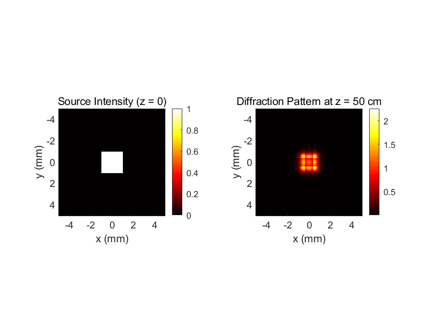

# optical imaging
# Free Space Optical Propagation (Angular Spectrum Method)

#  Hello optical world ！！！

A MATLAB implementation of optical wave propagation in free space using the **Angular Spectrum Method (ASM)**. 

This project demonstrates the scalar diffraction theory, specifically simulating how a plane wave propagates through a square aperture. It serves as a fundamental building block for computational imaging simulations.

## 1. Theoretical Background

The propagation of a complex optical field $U(x, y, 0)$ to a plane $z$ is calculated by solving the Helmholtz equation in the frequency domain.

The transfer function of free space $H(f_x, f_y)$ is given by:

$$H(f_x, f_y) = \exp \left( j k z \sqrt{1 - (\lambda f_x)^2 - (\lambda f_y)^2} \right)$$

Where:
- $\lambda$: Wavelength
- $k$: Wavenumber ($2\pi/\lambda$)
- $f_x, f_y$: Spatial frequencies

## 2. Simulation Results

Here is the simulation result of a 2mm square aperture propagating over 50cm distance ($\lambda = 632.8$ nm).

*(Left: Source Intensity; Right: Diffraction Intensity at z=50cm)*

## 3. Project Structure

- `src/`: Contains the MATLAB source code.
- `results/`: Contains the generated simulation figures.

## 4. How to Run

1. Clone this repository.
2. Open MATLAB and navigate to the `src` folder.
3. Run `main_propagation.m`.
4. The output figure will be saved in the `results` folder.

---
*Author: sun-optical*
*Keywords: Fourier Optics, MATLAB, Wave Propagation, Computational Physics*
